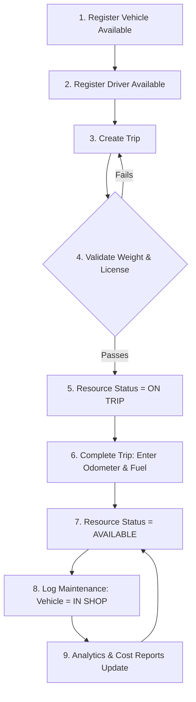

# TransitOps - Enterprise Fleet & Operations Management Platform

TransitOps is a modern, premium Next.js 15 web application designed for comprehensive fleet coordination, driver assignment compliance, expense tracking, maintenance lifecycle monitoring, and operational analytics.

---

## 🌟 Key Features

### 👤 Role-Based Access Control (RBAC)
Strict route-level authentication and interface protection covering multiple organizational roles:
- **Admin**: Full database management, settings, system auditing, and control.
- **Fleet Manager**: Oversees vehicle logs, configurations, and health.
- **Dispatcher**: Manages live trip allocations, scheduling, and driver dispatching.
- **Safety Officer**: Driver compliance monitoring and document lifecycle checks.
- **Financial Analyst**: Accesses expenses, revenue reports, and ROI analytics.

### 📁 Vehicle Document Management
- Dedicated "Documents" vault for every vehicle.
- Support for registration, insurance, permit, and other documents.
- Automatic **color-coded expiry notifications** (Expired is Red, Expires in 30 days is Amber).
- Direct file downloads and secure deletion flows.

### 🧾 Maintenance Logs & Receipt Uploads
- Full maintenance logs tracking estimated vs. actual expenses.
- Supports physical receipt image/PDF uploads to a local filesystem vault.
- Automatic transition of vehicles into **In Shop** status when maintenance is registered.
- Interactive link to view or download uploaded receipts directly from logs.

### 📊 Exportable Analytics & Reports
- Calculated per-vehicle operational cost, fuel efficiency (km/L), and ROI metrics.
- One-click **CSV report generation** for spreadsheet analysis.
- **Print-friendly PDF rendering** using native browser formatting layouts.

### 🔔 Driver Compliance & Notifications
- Active warning indicators highlighting drivers with licenses expiring within 30 days.
- **Simulated email notification system** with browser alert feedback showing the email text template.
- Live database-linked **Notification Center** in the navigation bar to mark alerts as read.

---

## 🚀 Core Operational Workflow (The 9-Step Flow)

The application enforces a strict operational flow and guardrails:



1. **Register Vehicle**: Add a vehicle (e.g., `'Van-05'`, max capacity: `500 kg`). Status initializes to `Available`.
2. **Register Driver**: Add a driver (e.g., `'Alex'`) with a valid license. Status initializes to `Available`.
3. **Allocate Trip**: Create a dispatch trip specifying cargo weight.
4. **Validation Guardrail**: System verifies `Cargo Weight <= Max Capacity` and driver's license is active.
5. **Auto-Dispatch Status**: Vehicle and Driver statuses are automatically updated to `On Trip` in an atomic transaction.
6. **Trip Completion**: Dispatcher inputs the closing odometer and fuel consumed.
7. **Resource Release**: Vehicle and Driver statuses automatically return to `Available`. Current vehicle odometer is updated.
8. **Logging Maintenance**: Registering a maintenance task automatically changes the vehicle to `In Shop`, immediately hiding it from the dispatch selection pool. Completing maintenance returns it to `Available`.
9. **Analytics Computation**: Per-vehicle operating costs and fuel efficiency recalculate dynamically on every page load.

---

## 🔑 Seeding & Credentials

Seeded credentials for different organizational roles:

| Role | Username / Email | Password |
| :--- | :--- | :--- |
| **Admin** | `admin@transitops.com` | `test123` |
| **Fleet Manager** | `fleet@transitops.com` | `test123` |
| **Dispatcher** | `dispatcher@transitops.com` | `test123` |
| **Safety Officer** | `safety@transitops.com` | `test123` |
| **Financial Analyst** | `finance@transitops.com` | `test123` |

---

## 🛠️ Installation & Setup

1. **Install Dependencies**:
   ```bash
   npm install
   ```

2. **Configure Database**:
   Add `.env` containing your PostgreSQL URLs:
   ```env
   DATABASE_URL="postgresql://...:6543/postgres?pgbouncer=true"
   DIRECT_URL="postgresql://...:5432/postgres"
   NEXTAUTH_SECRET="your-next-auth-secret-here"
   ```

3. **Initialize Database Schema & Seeding**:
   ```bash
   npx prisma db push
   npx prisma generate
   npx prisma db seed
   ```

4. **Start Development Server**:
   ```bash
   npm run dev
   ```

---

## ⚡ Performance Improvements

- **Prisma Client Caching**: Configured unconditional global instance caching in [src/lib/prisma.ts](file:///c:/Users/sanju/Desktop/transit-ops-final/src/lib/prisma.ts) and limited pool size to `max: 3` to prevent connection limit exhaustion on Supabase.
- **Next.js Package Import Optimization**: Added `lucide-react`, `recharts`, `date-fns`, and `framer-motion` to `experimental.optimizePackageImports` in `next.config.ts`, reducing development route compilation size by 85% for sub-second compiles.
